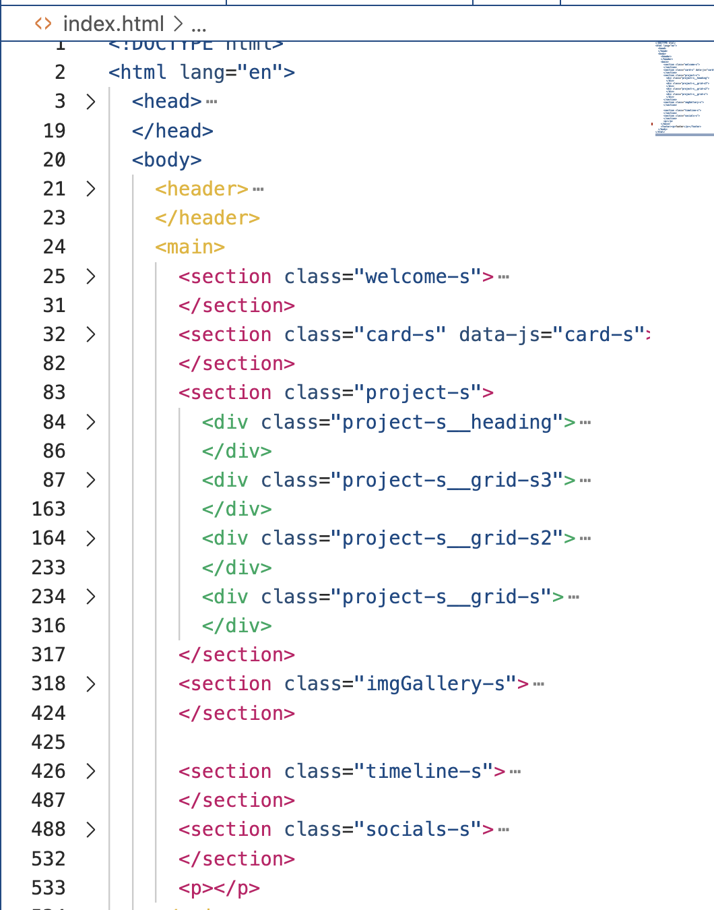

# My personal website

I use this Website to showcase myself with a clickable Biography section, a Project section, a chronological Timeline section, a pictures section and my social links. It's simple made and one of my first project's.

## Overall

As you can see the Structure of styling and folders follows
<a href="http://getbem.com/introduction">BEM</a>.

<!-- this is why the CSS files are organized according to their corresponding component. -->

## Sections

### Me and my biography Section-1

- Reasons to be a Web Developer
- Programming skills
- Programming experience
- I'd appreciate to hear from you
- Thing's I'd like to see
- Personal skills
- Capstone project

### Projects Section-2

- Rick & Morty
- That's My Quiz
- Bittegehweg.de
- Spoilnation

### Pics of my last vacation Section-3

### Small chronological timeline Section-4

- from birth to today

### Social Links Section-5

- LinkedIn
- Twitter
- GitHub
- Instagram
